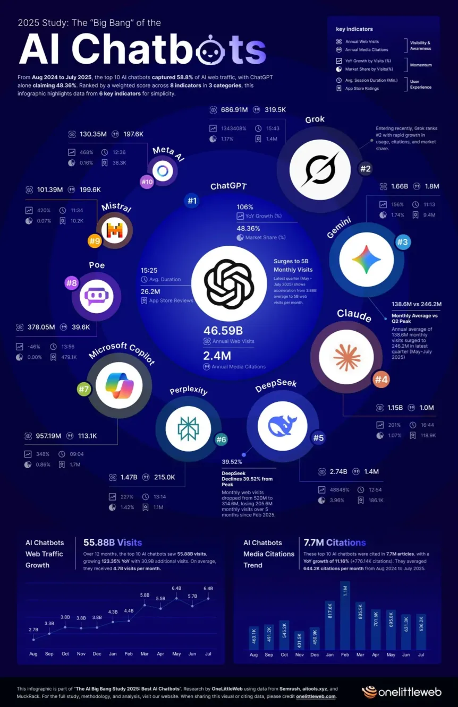

# How QS Works ?

Every signal you see here in Premium isn’t just a random AI prompt. Behind the scenes, QS runs on the top 5 LLM models, feeding them every type of public data we can get — price action, options flow, news, earnings, analyst reports, economic data, event transcripts, and more. Then comes the real edge: **deep quantitative modeling.**&#x20;

Anyone can throw together a prompt, but only A+++ quant modeling can consistently turn all that data into true alpha.&#x20;

Signals won’t hit every single day, but rest assured — we’re running on the best tech + data capacity available, and we’re constantly upgrading as AI evolves. That means QS grows as AI grows — smarter, sharper, better every day.&#x20;

<figure><figcaption></figcaption></figure>
